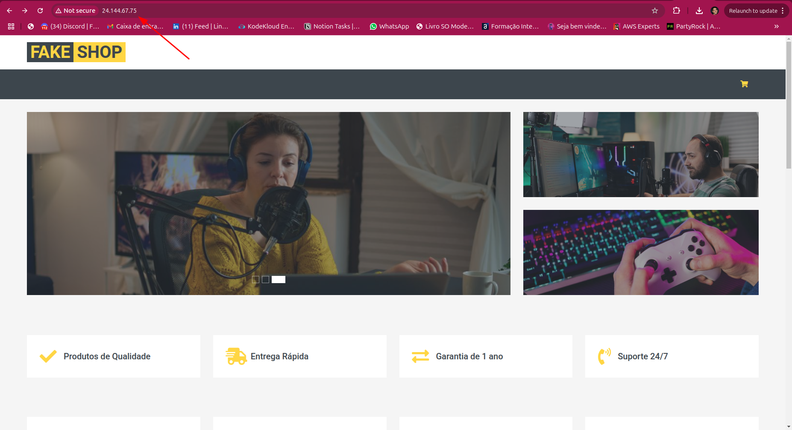
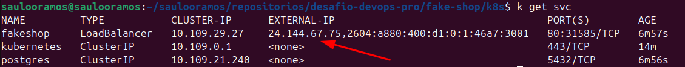

# Fake Shop

> Imagem da app funcionando em um IP público do cluster k8s na Digital Ocean

> Imagem do service do tipo Load Balancer com o IP público do cluster k8s na Digital Ocean

## Variável de Ambiente
DB_HOST	=> Host do banco de dados PostgreSQL.

DB_USER => Nome do usuário do banco de dados PostgreSQL.

DB_PASSWORD	=> Senha do usuário do banco de dados PostgreSQL.

DB_NAME	=>	Nome do banco de dados PostgreSQL.

DB_PORT	=>	Porta de conexão com o banco de dados PostgreSQL.
